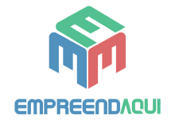
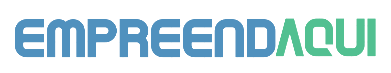

<!--
*** Thanks for checking out the Best-README-Template. If you have a suggestion
*** that would make this better, please fork the repo and create a pull request
*** or simply open an issue with the tag "enhancement".
*** Thanks again! Now go create something AMAZING! :D
-->

<!-- PROJECT SHIELDS -->
<!--
*** I'm using markdown "reference style" links for readability.
*** Reference links are enclosed in brackets [ ] instead of parentheses ( ).
*** See the bottom of this document for the declaration of the reference variables
*** for contributors-url, forks-url, etc. This is an optional, concise syntax you may use.
*** https://www.markdownguide.org/basic-syntax/#reference-style-links
-->

<!-- PROJECT LOGO -->
<br />
<p align="center">
  <a href="https://github.com/deboralbarros/hackathon-ccr2">
    
  </a>
  
  <h3>
      <p align="center">
        Aplicação com foco em Web Mobile
      </p>
  </h3>
  
  <br />
  <br />
    <p align="center">
      A solução que você estava esperando para se tornar um futuro empreendedor, com as ferramentas necessárias que te ajudam a trilhar essa jornada!
      <br />
      <br />
      <a href="https://www.figma.com/file/qQgBlxboVCGTH9rw9iIRry/EmpreendAqui?node-id=0%3A1"><strong>Explore a nossa solução! »</strong></a>
      <br />
      <a href="https://empreendaqui.vercel.app/">Veja a Demo</a>
    </p>
</p>

<br />
<br />

<!-- SUMARY -->
<details open="open">
  <summary>Sumário</summary>
  <ol>
    <li>
      <a href="#sobre-o-projeto">Sobre o Projeto</a>
    </li>
    <li>
      <a href="#instalacao-ferramentas">Instalação das Ferramentas</a>
    </li>
    <li>
      <a href="#desenvolvendo-o-projeto">Desenvolvendo o Projeto</a>
      <ul>
        <li><a href="#design-telas">Design e Construção das Telas</a></li>
        <li><a href="#codigo">O Código</a></li>
      </ul>
    </li>
    <li><a href="#roadmap">Roadmap</a></li>
    <li><a href="#time">Time</a>
      <ul>
        <li><a href="#entusiasta">Entusiasta da Educação</a></li>
        <li><a href="#design">Design/UX</a></li>
        <li><a href="#marketing">Marketing</a></li>
        <li><a href="#desenvolvedores">Desenvolvedores da Aplicação</a></li>
      </ul>
    </li>
    <li><a href="#bibliografia">Bibliografia</a></li>
  </ol>
</details>

<!-- ABOUT THE PROJECT -->

## Sobre o Projeto

<p align="center">
  <a href="https://github.com/deboralbarros/hackathon-ccr2">
    
  </a>
</p>

<strong>EmpreendAqui</strong> é uma aplicação Web Mobile com foco em ajudar o jovem empreendedor a trilhar essa jornada, através de uma plataforma digital que oferece apoio ao jovem de baixa renda que deseja iniciar um primeiro negócio, além de conectá-lo à empresas e fornecedores de suprimentos.

Motivação:

- O jovem é A aplicação EmpreendAqui ajuda o jovem a iniciar seu próprio negócio
-
-
-

<!-- GETTING STARTED -->

## Instalação das Ferramentas

Para a instalar as ferramentas necessárias para rodar este projeto, é necessário que você tenha instalado em sua máquina:

<ul>
  <li>
    <a href="https://git-scm.com/">Git</a>
  </li>
  <li>
  <a href="https://nodejs.org/en">npm</a>
  </li>
  <li>
  <a href="https://yarnpkg.com/">yarn</a> (opcional)
  </li>
</ul>

Após ter as ferramentas necessárias para instalar, você deve clonar este repositório na sua máquina, rodando o seguinte código em um terminal:

```
  git clone https://github.com/deboralbarros/empreendaqui.git/
```

Então, você precisa instalar as dependências do projeto:

```
cd empreendaqui
npm install
```

O comando <code>npm instal</code> pode ser substituído por <code>yarn</code>, caso você tenha instalado o yarn em sua máquina.

Então, para rodar o projeto, basta rodar <code>npm start</code> ou <code>yarn start</code> no seu terminal.

<!-- DEVELOPING THE CODE -->

## Desenvolvendo o Código

### Design e Construção das Telas

<!-- THE CODE -->

### O Código

<!-- ROADMAP -->

## Roadmap

<!-- CONTRIBUTING -->

## Contributing

<!-- ROADMAP -->

## RoadMap

<!-- TEAM -->

## Equipe

### Entusiasta da Educação

[Ana Clara Soares](https://www.linkedin.com/in/anaclarasoareso/)

### Design/UX

[Yago Webster](https://linkedin.com/in/yagowebster)

### Marketing

[Tedy Magalhães](https://www.linkedin.com/in/tedymas/)

### Desenvolvedores da Aplicação

[Stéfany Coimbra](https://www.linkedin.com/in/st%C3%A9fany-coimbra-23780a16b)

[Débora Barros](https://linkedin.com/in/debora-lbarros)

<!-- ACKNOWLEDGEMENTS -->

## Bibliografia

- [GitHub Emoji Cheat Sheet](https://www.webpagefx.com/tools/emoji-cheat-sheet)
- [Img Shields](https://shields.io)
- [Choose an Open Source License](https://choosealicense.com)
- [GitHub Pages](https://pages.github.com)
- [Animate.css](https://daneden.github.io/animate.css)
- [Loaders.css](https://connoratherton.com/loaders)
- [Slick Carousel](https://kenwheeler.github.io/slick)
- [Smooth Scroll](https://github.com/cferdinandi/smooth-scroll)
- [Sticky Kit](http://leafo.net/sticky-kit)
- [JVectorMap](http://jvectormap.com)
- [Font Awesome](https://fontawesome.com)

<!-- MARKDOWN LINKS & IMAGES -->
<!-- https://www.markdownguide.org/basic-syntax/#reference-style-links -->

[contributors-shield]: https://img.shields.io/github/contributors/othneildrew/Best-README-Template.svg?style=for-the-badge
[contributors-url]: https://github.com/othneildrew/Best-README-Template/graphs/contributors
[forks-shield]: https://img.shields.io/github/forks/othneildrew/Best-README-Template.svg?style=for-the-badge
[forks-url]: https://github.com/othneildrew/Best-README-Template/network/members
[stars-shield]: https://img.shields.io/github/stars/othneildrew/Best-README-Template.svg?style=for-the-badge
[stars-url]: https://github.com/othneildrew/Best-README-Template/stargazers
[issues-shield]: https://img.shields.io/github/issues/othneildrew/Best-README-Template.svg?style=for-the-badge
[issues-url]: https://github.com/othneildrew/Best-README-Template/issues
[license-shield]: https://img.shields.io/github/license/othneildrew/Best-README-Template.svg?style=for-the-badge
[license-url]: https://github.com/othneildrew/Best-README-Template/blob/master/LICENSE.txt
[linkedin-shield]: https://img.shields.io/badge/-LinkedIn-black.svg?style=for-the-badge&logo=linkedin&colorB=555
[linkedin-url]: https://linkedin.com/in/othneildrew
[product-screenshot]: images/screenshot.png
